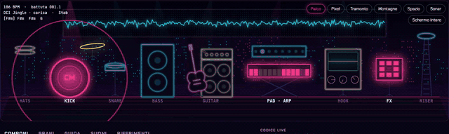
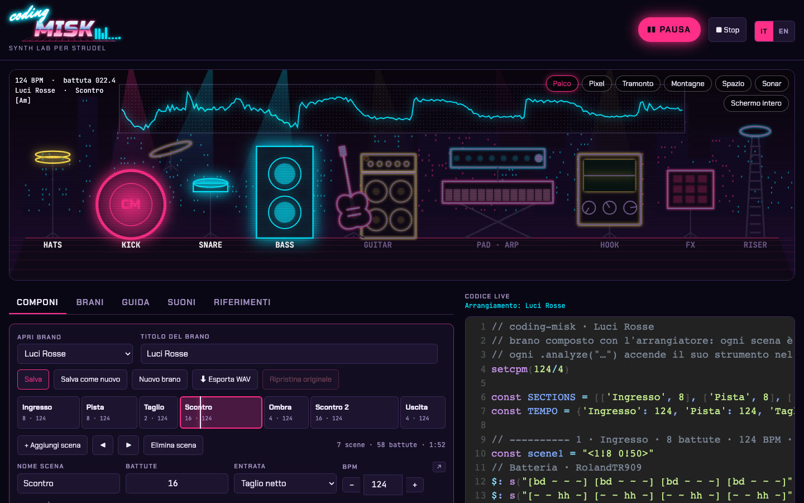
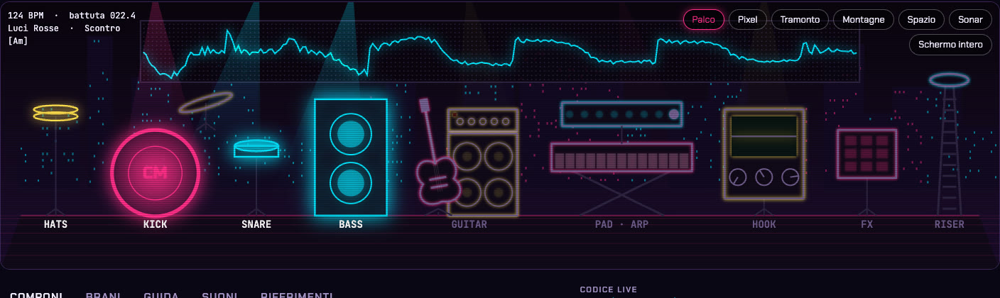
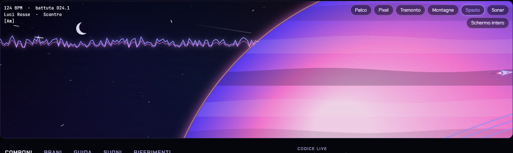
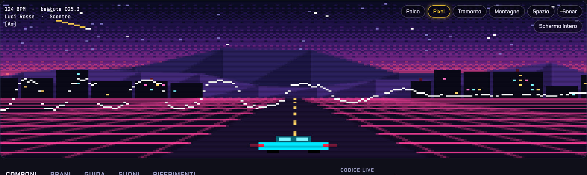
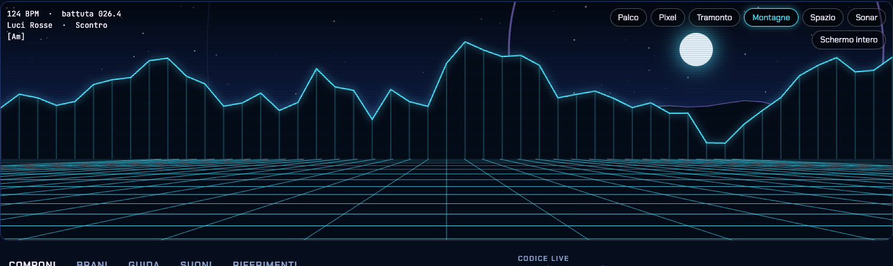
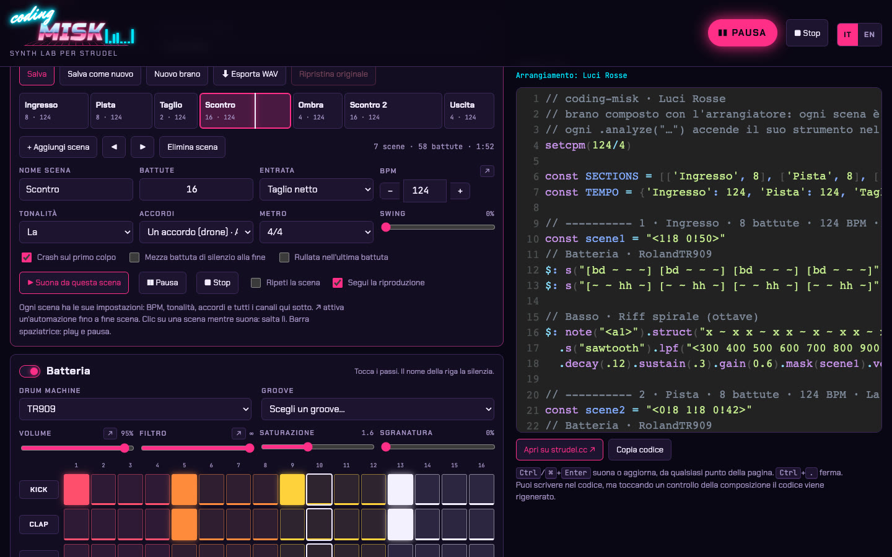
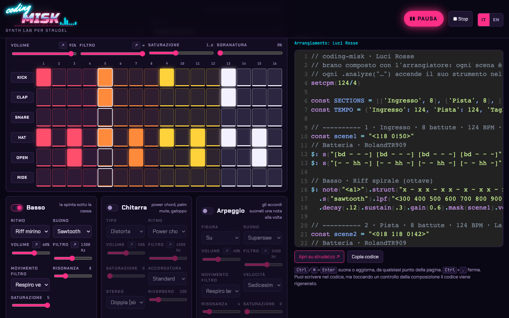
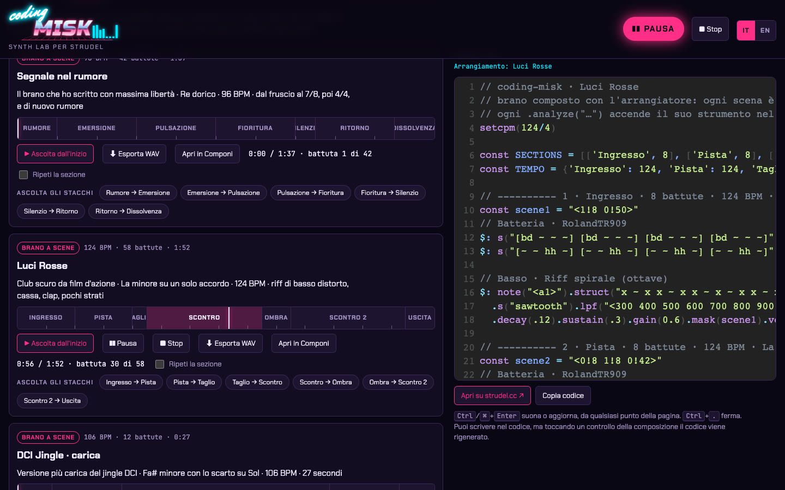

# coding-misk

[English](README.md) · **Italiano**

Un laboratorio locale per comporre musica scrivendo codice, costruito sopra [Strudel](https://strudel.cc/), il porting JavaScript di [TidalCycles](https://tidalcycles.org/). Ogni brano diventa codice Strudel leggibile, che suona nel browser insieme a visual sincronizzati con gli strumenti.

## Demo



[Guarda la demo da 38 secondi con audio (MP4)](docs/media/demo.mp4)



|                                                          |                                                        |
| -------------------------------------------------------- | ------------------------------------------------------ |
|               |           |
|               |       |
|  |  |



## Ascolta

Cinque brani esportati con l'export WAV dell'app (qui in MP3). Sono tutti anche nell'app, dove puoi aprirli in Compose e leggerne il codice.

| Brano | Stile | Durata |
| --- | --- | --- |
| [Kellerlicht](docs/media/audio/kellerlicht.mp3) | Techno trance scura da scantinato berlinese con un ultimo drop synthwave, Fa minore, 132 BPM | 4:53 |
| [Luci Rosse](docs/media/audio/luci-rosse.mp3) | Club scuro da film d'azione, La minore su un solo accordo, 124 BPM | 1:55 |
| [Ghost Protocol](docs/media/audio/ghost-protocol.mp3) | Hard techno cyberpunk, tempo da 132 a 148 BPM | 1:45 |
| [Segnale nel rumore](docs/media/audio/segnale-nel-rumore.mp3) | Brano libero scritto da Claude, Re dorico, dal fruscio al 7/8 e ritorno | 1:40 |
| [Pioggia sul vetro](docs/media/audio/pioggia-sul-vetro.mp3) | Lo-fi hip hop, Re minore, 78 BPM con swing | 1:53 |
| [DCI Jingle carica](docs/media/audio/dci-carica.mp3) | Jingle tech breve, Fa# minore, 106 BPM | 0:30 |

## Da dove nasce

Un anno fa mi ero appassionato ai video di [Switch Angel](https://www.youtube.com/@Switch-Angel), in particolare a [Coding Trance Music](https://www.youtube.com/watch?v=GWXCCBsOMSg). Mi era rimasta dentro l'idea di musica come codice con strudel.cc: brani costruiti dal vivo, riga dopo riga.

Questo progetto unisce quell'idea alle capacità dei nuovi modelli, con il mio taglio. Il motore iniziale era rigido. L'ho esteso con Claude, insistendo a ogni giro, finché non è diventato capace di produrre brani con una struttura vera: sezioni, transizioni, tempi dispari, chitarre, mix bilanciato.

## Cosa fa

- **Arrangiatore.** Una griglia di tracce e sezioni. Le sezioni tengono tempo (anche in rampa), tonalità, accordi, metro (4/4, 3/4, 5/4, 7/8), swing ed entrata (taglio netto o dissolvenza). Le tracce sono libere: quanti strumenti vuoi, anche dello stesso tipo, ognuno con i suoi pattern, muto e solo. Tutto diventa codice Strudel in tempo reale.
- **Trova i brani.** La scheda Brani è una lista unica con ricerca (titolo, stile, tonalità, tag), filtri per genere, stile e tipo (standard, live build, generato, tuo, codice), preferiti e ordinamento. I tag di stile seguono la scheda Stili, e puoi taggare i tuoi brani.
- **Guida la radio.** Una console nella scheda Radio cambia il brano in onda alla frase successiva: energia, strumenti dentro e fuori, più scuro o più sporco, accordi e tonalità, più o meno voce, vai al drop, resta qui, chiudi. Trascini la curva dell'energia, regoli e blocchi le tracce, e riascolti una sessione con le stesse mosse.
- **Transizioni.** Nella radio i brani passano l'uno nell'altro come in un DJ set: mix, morph, break con riser, eco in uscita, interludio o stacco netto, scelti dal gusto dell'artista o da un menu, con armonia compatibile o libera. Anche le playlist possono mixare i brani salvati.
- **Playlist.** I Preferiti (la stella su ogni brano) e le tue playlist, gestite nella scheda Playlist e scelte nella scheda Brani. I brani suonano uno dopo l'altro, con casuale e ripeti (tutta la playlist o un brano) nella barra del player. Esporta e importa in JSON.
- **Brani in JSON.** I brani sono file in `songs/` con un formato documentato, un validatore e uno strumento da riga di comando, così persone e agenti possono scriverli come codice ([docs/COMPOSING.md](docs/COMPOSING.md)). Le tracce di codice contengono Strudel scritto a mano dentro un brano.
- **Strumenti.** Sequencer di batteria con varie drum machine, basso con riff, chitarra (pulita, crunch, distorta, metal, palm mute) con riff e raddoppio stereo, arpeggio, hook con armonie e modi scuri, pad, texture (voci, metalli, vinile), riser. Ogni strumento può usare oscillatori o suoni General MIDI, ha i suoi passi ritmici, e basso, arpeggio e hook accettano note scritte come gradi dell'accordo o della scala.
- **Automazioni.** Volume, filtro e tempo possono cambiare da inizio a fine sezione. Ci sono saturazione, bitcrusher, risonanza, FM e filtro vocale.
- **Player.** Timeline cliccabile, salto a qualsiasi battuta, pulsanti per ascoltare gli stacchi tra le sezioni, ripetizione di una sezione, pausa e ripresa.
- **Brani inclusi.** Una ventina di brani in generi diversi: techno, trance, hard techno, industrial, club scuro, metal, metal melodico, phonk, progressive rock, lo-fi, arcade anni '90, più un reel da 30 secondi.
- **Browser dei suoni.** Tutti i suoni caricati da Strudel (circa 1.200 senza gli alias: 71 drum machine, 125 strumenti General MIDI, banchi di campioni, strumenti acustici, synth, i tuoi campioni) con ricerca, categorie, schede, lista e pad suonabili da tastiera, immagini in pixel art e foto libere delle drum machine più famose. Un clic mette il suono nella traccia selezionata.
- **Visual.** Sette temi su canvas (Palco, Pixel, Tramonto, Montagne, Spazio, Sonar, Edgerunners). Ogni strumento ha il suo analizzatore audio, così sul Palco batteria, basso, chitarra, tastiere e FX si accendono quando suonano.
- **Tema interfaccia hardware.** Si passa da neon a hardware: manopole al posto dei cursori, piccoli display ambra, LED di accensione e di attività su ogni canale, pannelli anodizzati.
- **Esportazione WAV.** Registra il brano in tempo reale dall'uscita di Strudel e scarica un WAV stereo.
- **Campioni personalizzati.** I file messi in `public/samples/` diventano suoni utilizzabili nei brani.
- **Barra player e volume.** Una barra bassa in fondo, in ogni scheda: play e pausa, stop, brano precedente e successivo (nella radio: riparti dall'inizio del brano, salta), titolo e posizione, una spia ON AIR e un volume unico per tutta l'app con muto. Il volume cambia solo quello che senti: gli export WAV restano allo stesso livello.
- **Artisti e stili.** Sei artisti con un volto in pixel art, una bio e un gusto (stili preferiti, energia, ritmo dei cambi, voce, manie) fanno la musica della radio, ogni brano diverso; scegline uno nella Radio o parti da uno in Componi con un brano nuovo. Le schede Artisti e Stili mostrano ognuno come una scheda, e puoi duplicarli, modificarli, crearne di nuovi, esportarli e importarli ([docs/ARTISTS.md](docs/ARTISTS.md)).
- **Live coding a mano.** Mentre un brano si costruisce da solo, scrivi nel codice per prendere il controllo: i passi si fermano e suona il tuo codice; "Riprendi il divenire" restituisce il controllo al brano, e il tuo ultimo codice resta a portata di mano.
- **Sessioni endless (prima fase).** Un regista scrive sessioni di brani a partire da dodici ricette di stile (Berlin techno, trance, synthwave, lo-fi, drum and bass, ambient, phonk, industrial, jazz, country, rock classico, metal melodico), mescola gli stili con una dose di caos, segue curve di energia e costruisce ogni brano dal vivo con commenti parlati. Stesso seme, stessa musica. La scheda **Radio** li suona senza fine: scegli stili, caos, energia e complessità, premi In onda; una scheda "ora in onda" mostra il brano, la sua curva di energia e i prossimi cambi; puoi saltare, salvare un brano, aprirlo in Componi, riascoltare una sessione dal suo seme. La riga di comando produce gli stessi brani: `npm run endless -- --styles synthwave,jazz --seed aurora --join` ([docs/ENDLESS.md](docs/ENDLESS.md)).
- **Guida e suoni.** 14 lezioni da ascoltare e una libreria per provare drum machine, oscillatori e campioni.
- **Italiano e inglese**, anche nei commenti del codice generato.

## Idee e prossimi passi

Il backlog è nelle [issue del repository](https://github.com/alessandrodevecchi/coding-misk/issues). Le idee principali:

- **Voci.** Capire come generarle, probabilmente con un piccolo modello locale.
- **Live coding.** Arrivare a ricreare un brano costruito dal vivo, come nei video di Switch Angel.
- **Musica per video brevi.** Usare i brani come sottofondo per reel e contenuti social, con durate e partenze già pronte.
- **Mood e preset.** Definire mood e preset riutilizzabili, per comporre più in fretta e con più varietà.
- **Altri generi.** Continuare a esplorare stili diversi, con meno strati e più ritmo.

## Avvio

Serve Node.js 20 o successivo.

```sh
npm install
npm run dev
```

Si apre <http://localhost:5173>. La barra spaziatrice fa play e pausa, `Ctrl+Enter` (o `⌘+Enter`) avvia o aggiorna, `Ctrl+.` ferma.

## Branch

- `main` contiene la versione stabile.
- `develop` raccoglie le evoluzioni in prova. Quando una novità è confermata, `develop` viene unito in `main`.

## Struttura

| Percorso         | Contenuto                                                                                 |
| ---------------- | ----------------------------------------------------------------------------------------- |
| `index.html`     | Markup dell'interfaccia                                                                   |
| `src/main.js`    | Libreria dei brani, arrangiatore, controlli, trasporto, collegamento con l'editor Strudel |
| `src/music.js`   | Tonalità, accordi, preset, generatore di codice per strumento                             |
| `src/song/`      | Formato dei brani: compilatore, validatore, conversione dei salvataggi vecchi             |
| `songs/`         | Brani inclusi in JSON, `songs/examples/` per la guida                                     |
| `src/endless/`   | Regista endless: ricette, mescolanza, curve di energia, mosse, sessioni                   |
| `styles/`        | Ricette di stile per le sessioni endless                                                  |
| `src/songs.js`   | Lettura di sezioni e tempo dal codice di un brano                                         |
| `src/visuals.js` | Visual su canvas sincronizzati con l'audio                                                |
| `src/i18n.js`    | Testi in italiano e inglese                                                               |
| `src/content.js` | Lezioni, libreria suoni, riferimenti                                                      |
| `src/style.css`  | Stili e temi                                                                              |
| `vite.config.js` | Plugin che pubblica i campioni di `public/samples/`                                       |
| `patterns/`      | Pattern di esempio e brani scritti a mano, anche da incollare su strudel.cc               |

## Collegare uno strumento ai visual

Aggiungi `.analyze("nome")` a un layer. Nomi riconosciuti dal Palco: `kick`, `snare`, `hats`, `fx`, `bass`, `guitar`, `arp`, `pad`, `hook`, `riser`. Il codice senza tag usa un canale generico.

## Campioni personalizzati

Metti file WAV, MP3, OGG o FLAC in `public/samples/`: una cartella per strumento (`voce/01.wav` diventa `s("voce").n(0)`) o un file sciolto (`swoosh.wav` diventa `s("swoosh")`). I suoni compaiono nel canale Texture e nel tab Suoni dopo un ricaricamento. Dettagli in `public/samples/README.md`.

## Note tecniche

- Strudel è una dipendenza npm (`@strudel/repl`), non un fork. Per aggiornarlo: `npm update @strudel/repl`.
- I campioni arrivano da GitHub al primo utilizzo, quindi serve la connessione. L'app carica l'archivio completo di dirt-samples.
- Il tempo dei brani lo cambia il player battuta per battuta. Un `.cps()` dentro un pattern fa perdere note allo scheduler.
- I brani dichiarano due righe lette dal player, con apici singoli: `const SECTIONS = [['intro', 8], …]` e `const TEMPO = {'intro': 132, 'build': [132, 140], …}`.
- Nel codice Strudel i doppi apici e i backtick sono mini-notation. Le stringhe JavaScript normali vanno tra apici singoli; `mini('…')` le trasforma in pattern.
- Rampe di tempo, salto a una battuta e campioni extra funzionano solo in coding-misk, non su strudel.cc.
- I brani salvati e la bozza in corso stanno nel `localStorage` del browser. Svuotare i dati del sito li cancella.
- Strudel è distribuito con licenza AGPL-3.0. Se il progetto viene pubblicato, il codice va rilasciato con una licenza compatibile.

## Licenza

AGPL-3.0-or-later, la stessa licenza di Strudel. Vedi [LICENSE](LICENSE). Le foto delle drum machine vengono da Wikimedia Commons con le loro licenze: vedi [public/sounds/photos/CREDITS.md](public/sounds/photos/CREDITS.md).
